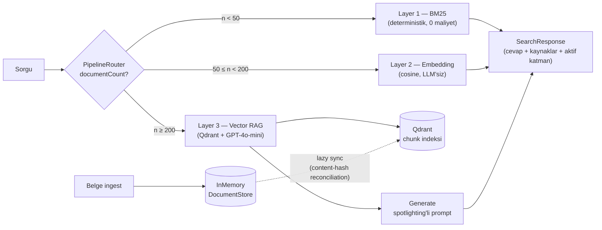

# ColdStart — Sparse Knowledge Environments için Adaptif Hibrit RAG

> İstanbul Nişantaşı Üniversitesi · Bilgisayar Mühendisliği Tezsiz Yüksek Lisans Bitirme Projesi
> Kubilay Özyalçın · *********** · Bahar 2025-26

## Problem

Klasik Retrieval-Augmented Generation (RAG) mimarileri, yeterince dolu bir vektör veri tabanı **varsayar** (Lewis et al., 2020; Gao et al., 2024). Sistem ilk kurulduğunda bilgi tabanı boştur: embedding üretilmemiştir, semantik arama çalışmaz, LLM cevabı temellendirilemez — **cold start problemi**. Az veride embedding sinyali zayıftır; LLM çağrısı hem maliyetli hem halüsinasyona açıktır.

Hybrid RAG literatürü (Masood, 2024) retrieval yöntemlerini hep *eşzamanlı* (parallel ensemble) birleştirir. ColdStart'ın katkısı, **veri yoğunluğuna duyarlı sequential transition**: sistem, corpus büyüklüğüne göre uygun retrieval stratejisini *runtime'da* seçer.

## Mimari

Üç katmanlı adaptif pipeline; `PipelineRouter` her istekte `documentCount`'u okuyarak katman seçer:

| Katman | Aralık | Teknoloji | LLM |
|---|---|---|---|
| **Layer 1 — Keyword** | `n < 50` | BM25 (k1=1.5, b=0.75) + Türkçe-duyarlı tokenizer | Yok |
| **Layer 2 — Lightweight** | `50 ≤ n < 200` | OpenAI `text-embedding-3-small` + cosine similarity | Yok |
| **Layer 3 — Full RAG** | `n ≥ 200` | Qdrant + Semantic Kernel + GPT-4o-mini | Var |



Eşikler `appsettings.json → Pipeline:Layer2Threshold / Layer3Threshold` üzerinden yapılandırılır. Belge silindiğinde router doğal olarak alt katmana döner (downgrade); Qdrant indeksi lazy reconciliation ile store'a yakınsar.

### Çözüm yapısı

```
/src
  ColdStart.Core          # Abstraction'lar, Result pattern, PipelineRouter, metrik altyapısı
  ColdStart.Persistence   # InMemoryDocumentStore (thread-safe)
  ColdStart.Keyword       # Layer 1 — BM25
  ColdStart.Embedding     # Layer 2 — OpenAI embedding + cosine
  ColdStart.VectorRag     # Layer 3 — Qdrant, chunking, Semantic Kernel, LLM-as-a-judge
  ColdStart.Api           # ASP.NET Core API + demo UI (wwwroot)
/tests
  ColdStart.Tests         # xUnit — 44 test (unit + Qdrant integration)
/experiments
  ColdStart.Experiments   # Batch deney harness'ı → CSV (data/results/)
/data
  synthetic/              # 15 belgelik el yazımı seed corpus
  results/                # Deney çıktıları
```

## Kurulum ve Çalıştırma

Gereksinimler: .NET 8 SDK, Docker (Layer 3 için), OpenAI API anahtarı (Layer 2+ için).

```bash
# 1. API anahtarı (kod tabanına asla girmez; env tek başına yeterli)
export OPENAI_API_KEY="sk-..."
#    alternatif: dotnet user-secrets set "OpenAi:ApiKey" "sk-..." --project src/ColdStart.Api

# 2. Qdrant (Layer 3) — imaj sürümü Qdrant.Client ile hizalıdır, değiştirmeyin
docker compose up -d

# 3. API + demo UI
dotnet run --project src/ColdStart.Api
# → http://localhost:5266 (UI) · /swagger · /api/status
```

### API

| Endpoint | Açıklama |
|---|---|
| `POST /api/search` | Adaptif arama — aktif katman cevabı + kaynaklar |
| `POST /api/document` | Belge ekleme (10.000 karakter üst sınır) |
| `DELETE /api/document/{id}` · `DELETE /api/document` | Silme / tümünü temizleme |
| `GET /api/status` | Belge sayısı, aktif katman, sonraki eşiğe kalan |
| `POST /api/evaluate` | Arama + LLM-as-a-judge puanlama (faithfulness, relevancy) |
| `GET /api/metrics` | Arama kayıtları + katman geçiş zaman çizelgesi |

Demo UI; katman göstergesi, canlı metrik paneli ve "Sorgula + Değerlendir" akışıyla tüm bu endpoint'leri görselleştirir.

### Deneyler

```bash
dotnet run --project experiments/ColdStart.Experiments -- transition              # ücretsiz, LLM'siz
dotnet run --project experiments/ColdStart.Experiments -- activation --with-llm   # OpenAI çağrısı yapar
dotnet run --project experiments/ColdStart.Experiments -- sensitivity --with-llm
```

## Ampirik Bulgular (GPT-4o-mini hakem, 2026-06)

**Eşik doğrulaması:** Layer transition accuracy 3 konfigürasyonda **30/30 (%100)** — geçişler tam eşik değerinde.

**Strateji karşılaştırması** (corpus ≤ 30 belge, 3 altın sorgu):

| Strateji | Relevancy | Faithfulness | Gecikme | hit@3 |
|---|---|---|---|---|
| **Adaptif** (L1 bölgesi) | 0.55 | 0.75 | **~1 ms** | %100 |
| Embedding-only | 0.43 | 0.59 | 369 ms | %100 |
| RAG-only | **0.75** | 0.75 | 1862 ms | %100 |

Küçük corpus'ta BM25, embedding-only baseline'dan **daha alakalı** sonucu **sıfır LLM maliyetiyle** verir; adaptif tasarım LLM maliyetini corpus bunu hak edene kadar erteler.

**Eşik sensitivity:** L1 relevancy corpus büyüdükçe düşer (0.77 → 0.50), L2 sabit ~0.55 kalır; **kesişim ~50 belgede** gerçekleşir → `Layer2Threshold = 50` ampirik gerekçeli. L3 her boyutta 1.00 relevancy ile kalite tavanıdır; geçişin 200'e ertelenmesi kalite değil **maliyet-fayda** kararıdır.

**Katman kalite asimetrisi:** Aynı sorguda Layer 2 cevabı (snippet birleştirme) hakemden *relevancy 0.2*, Layer 3 cevabı (LLM sentezi) *relevancy 1.0* aldı — üst katmana geçişin varlık nedeni.

## Güvenlik

Input validation, içerik üst sınırı, IP başına rate limiting (120/dk), exception sızdırma engeli (`ProblemDetails`), XSS-güvenli UI (`textContent`-only), user-secrets ile anahtar yönetimi. Layer 3'te **spotlighting**: retrieval içerikleri `<<DOC_START>>/<<DOC_END>>` ile çerçevelenir, system prompt bunları veri olarak işaretler (prompt injection önlemi); corpus dışı soruda model cevap üretmeyi reddeder.

## Kaynakça (özet)

1. Lewis, P. et al. (2020). *Retrieval-Augmented Generation for Knowledge-Intensive NLP Tasks.* NeurIPS.
2. Gao, Y. et al. (2024). *Retrieval-Augmented Generation for LLMs: A Survey.* arXiv:2312.10997.
3. Asai, A. et al. (2024). *Self-RAG.* ICLR.
4. Chen, H. & Xu, H. (2025). *ColdRAG.* arXiv:2505.20773.
5. Masood, A. (2024). *Hybrid RAG: A Comprehensive Survey.* arXiv:2410.12837.

Akademik problem tanımı: [`PROJECT_BRIEF.md`](PROJECT_BRIEF.md)

## Lisans

MIT — bkz. [LICENSE](LICENSE).
